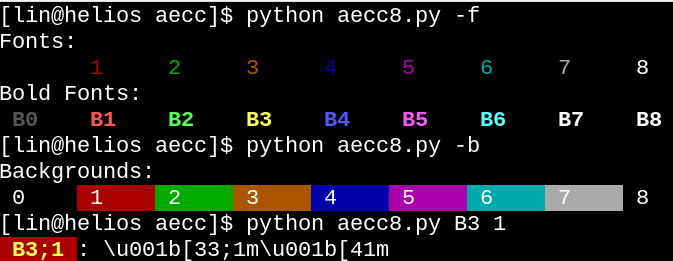
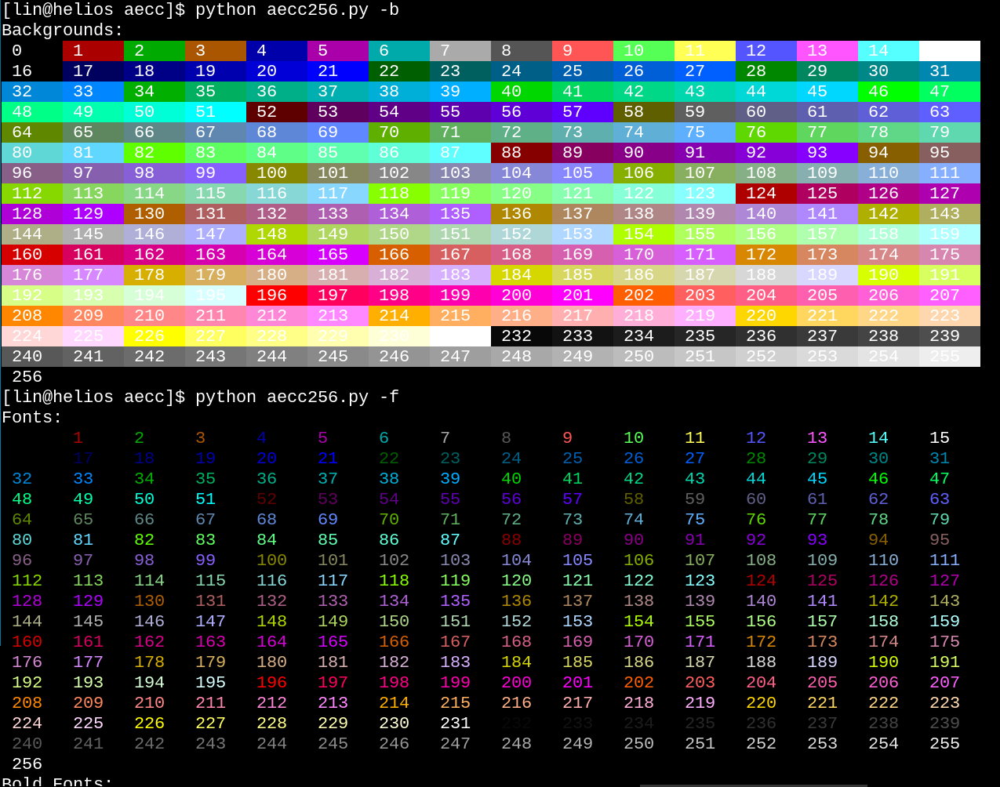

# aecc

**A**NSI **e**scape **c**ode **c**olor

A tool for looking up terminal color codes. 

## Usage

```
usage: aecc8.py [-h] [-f] [-b] [font] [background]

A tool for looking up ANSI escape code colors (8 colors)

positional arguments:
  font                  Specicfy font color by a label, 8 represents default color, e.g. 3, B3
  background            Specicfy background color by a label, e.g. 5

optional arguments:
  -h, --help            show this help message and exit
  -f, --show-font       Display font colors
  -b, --show-background
                        Display background colors
```

## Screenshots




