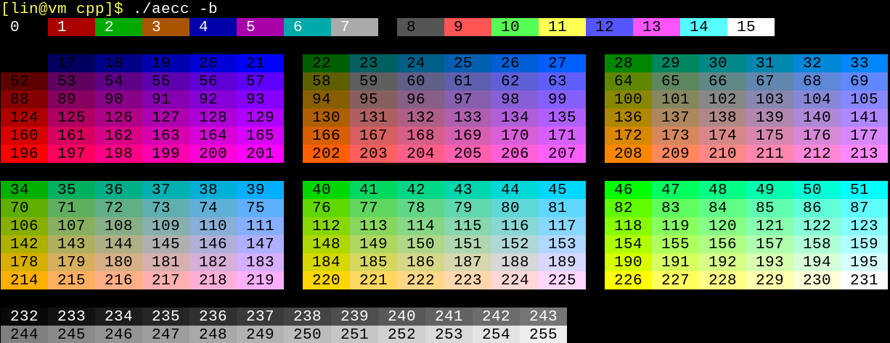
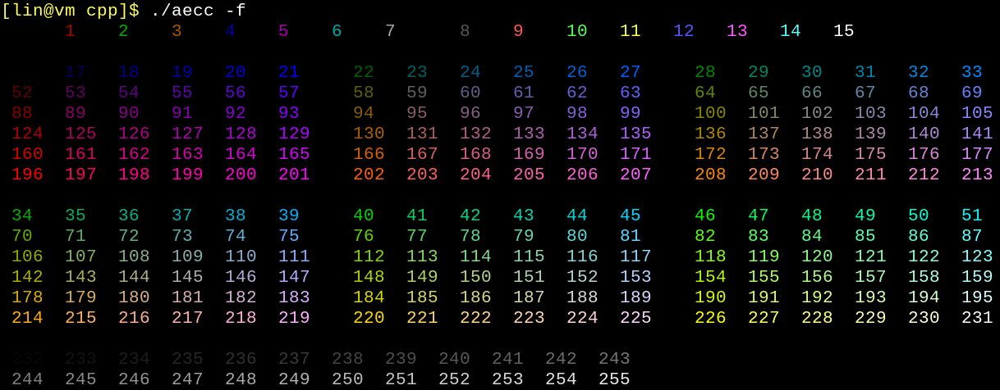
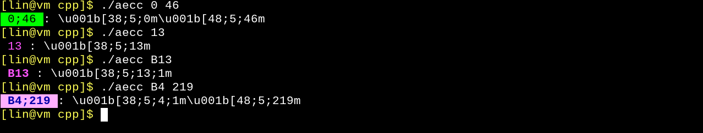

# aecc

**A**NSI **e**scape **c**ode **c**olor

A tool for looking up terminal color codes. 

## Screenshots

Show background color labels:



Show font color labels:



Get ANSI escape codes by labels.



## Build

C++

```
$ cd cpp
$ make
$ ./aecc
```

Python

```
$ python python/aecc256.py
```

## Usage

```
Usage: [options] font background 

ANSI escape code color lookup (256 colors)

Positional arguments:
font                Specicfy font color by a label (e.g. 3), B[label] represents 
                    bold font (e.g. B122), 256 represents default color 
background          Specicfy background color by a label (e.g. 5), 256 represents
                    default color 

Optional arguments:
-h --help           shows help message and exits
-v --version        prints version information and exits
-f --font           Display font labels 
-b --background     Display background labels 
```

